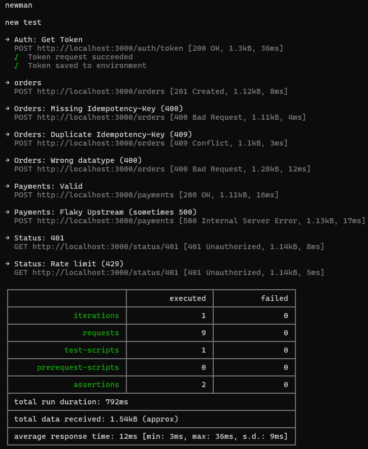

# Integration Failure Playground

A focused API sandbox designed to simulate real-world integration failure patterns.

This project models common production scenarios encountered in SaaS and partner integrations, including authentication errors, authorization gaps, schema mismatches, idempotency conflicts, rate limiting, and unstable upstream dependencies.

The goal is not feature breadth, but controlled failure simulation and disciplined debugging.

---

## Architecture Overview

The service is structured around explicit middleware boundaries:

- Authentication (JWT validation + expiry)
- Authorization (scope-based access control)
- Schema validation (Zod)
- Idempotency enforcement (in-memory key store)
- Rate limiting (Retry-After compliant)
- Centralized error envelope
- Request correlation via `X-Request-Id`
- OpenAPI 3.0 documentation
- Automated integration verification via Newman

Each concern is isolated and composable.

---

## Failure Modes Simulated

The API intentionally produces:

- **401 Unauthorized** — missing, invalid, or expired token
- **403 Forbidden** — valid token, insufficient scope
- **400 Bad Request** — schema validation or header errors
- **409 Conflict** — idempotency key reuse
- **429 Too Many Requests** — rate limiting with `Retry-After`
- **500 Internal Error** — simulated upstream instability

These reflect typical integration support and debugging workflows.

---

## Local Development

Install dependencies:

npm install

Start the service:

npm run dev

Base URL:

http://localhost:3000

Swagger documentation:

http://localhost:3000/docs

---

## Automated Integration Execution

The repository includes a Postman collection and environment.

To run a full integration sequence:

npm run demo

This command:

1. Starts the server
2. Waits for readiness
3. Executes the Postman collection via Newman
4. Validates response codes
5. Shuts down the server

This enables deterministic validation of all simulated failure paths.

---

## Integration Flow

1. Acquire token via `POST /auth/token`
2. Create order (`POST /orders`)
3. Trigger idempotency conflict (409)
4. Trigger validation error (400)
5. Trigger upstream instability (500)
6. Trigger rate limiting (429)

All responses include structured error envelopes and correlation IDs.

---

## Observability & Debugging

Every response includes:

- `requestId` in body
- `X-Request-Id` header
- Structured error codes

See `docs/runbook.md` for failure analysis patterns and retry strategies.

---

## Engineering Intent

This project demonstrates:

- Middleware-driven Express architecture
- Clear separation of concerns
- Explicit failure modeling
- Defensive API design
- Idempotent resource creation patterns
- Scope-based authorization
- OpenAPI-driven documentation
- CLI-driven integration validation

The emphasis is on integration reliability, diagnosability, and failure transparency rather than feature complexity.

---

## Use Case

Designed for engineers working in:

- API integrations
- SaaS platforms
- B2B partner ecosystems
- Payment or order processing systems
- Developer platform teams

This repository serves as a compact, controlled reference implementation of common integration edge cases.
